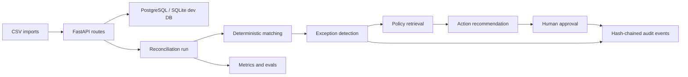

# Architecture

## System Shape

## Core Decisions

### FastAPI

Chosen because the API surface is small, typed, and easy to inspect in OpenAPI. Django was rejected
because its admin and batteries are useful, but they hide too much architecture for this learning
goal.

### PostgreSQL + SQLAlchemy 2

PostgreSQL is the production target because finance workflows need relational integrity. SQLite is
used in tests so the system remains fast and easy to verify locally.

### Integer Money

Amounts use `amount_cents: int`. `Float` was rejected because binary floating point can represent
money incorrectly and create reconciliation bugs.

### CSV Before OCR

CSV ingestion proves the finance workflow without distracting the project with OCR quality,
document layout, or PDF parsing. OCR can be added later as an ingestion adapter.

### Deterministic Matching Before AI

Matching is rules-first because the system must explain why an invoice and payment match. AI is used
for explanation/action recommendation, not as the source of financial truth.

### Direct Retrieval And Optional LLM

The retrieval layer is direct code, not LangChain, so the call path is visible. In local/test mode,
policy chunks store deterministic JSON embeddings and use cosine similarity. In a production
PostgreSQL deployment, this boundary is the place to swap `embedding_json` for native pgvector
without changing the rest of the application. The LLM is optional; the deterministic fallback keeps
the system testable without external services.

### RQ Worker Boundary

Reconciliation is modeled as a job because it can fail, retry, and take time. FastAPI
`BackgroundTasks` was rejected because it is too weak for durable finance workflows.

## File Responsibilities

- `models.py`: database truth and relationships.
- `domain/money.py`: safe money conversion.
- `domain/normalization.py`: input cleanup before persistence.
- `services/matching.py`: deterministic matching score.
- `services/exceptions.py`: finance exception rules.
- `services/policies.py`: policy retrieval.
- `services/actions.py`: deterministic and optional LLM action recommendation.
- `services/approvals.py`: human decision permissions.
- `services/audit.py`: hash-chain audit evidence.
- `services/evals.py`: metrics generated from labeled cases.

## Public Scope Boundaries

- The financial truth path is deterministic: normalized records, matching scores, exception rules,
  approval checks, and audit events.
- The AI path is advisory: it explains exceptions and proposes actions, but it cannot bypass
  matching, permissions, or audit.
- The ingestion layer starts with CSV. XML e-invoicing adapters such as PEPPOL UBL can be added
  later without changing the reconciliation core.
- v1 emphasizes correctness, auditability, and explainability over production-scale throughput.
